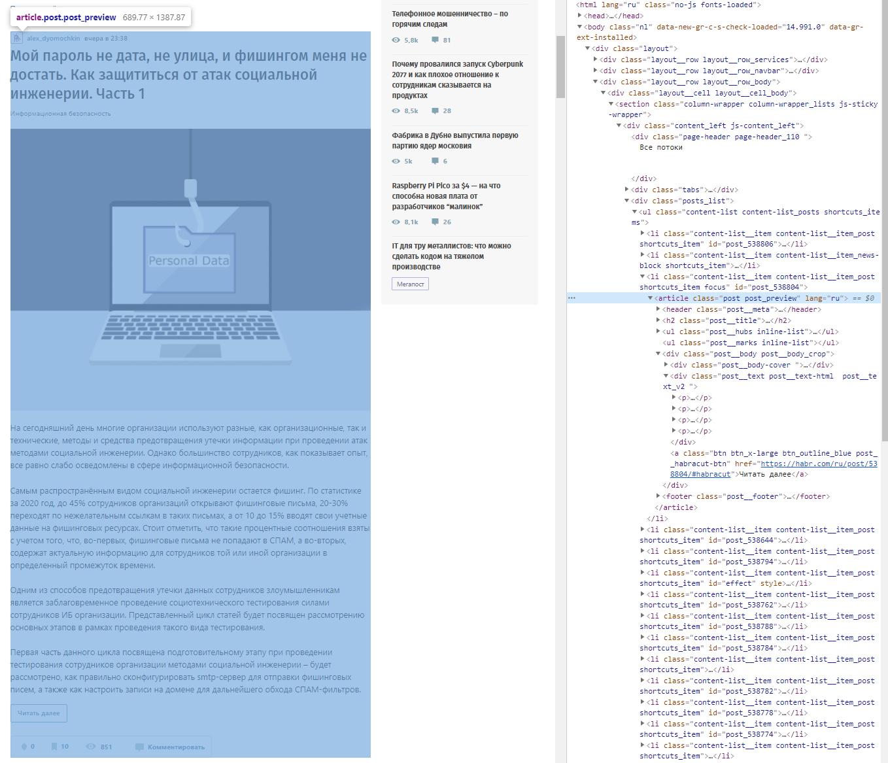

# Домашнее задание к лекции 6. «Web-scrapping» (предыдущая версия)

Попробуем получать интересующие нас статьи на [Хабре](https://habr.com) самыми первыми.

Нужно парсить страницу со свежими статьями ([вот эту](https://habr.com/ru/all/)) и выбирать те статьи, в которых встречается хотя бы одно из ключевых слов. 

Эти слова определяем в начале скрипта. Поиск вести по всей доступной preview-информации, т. е. по  информации, доступной с текущей страницы.

Выведите в консоль список подходящих статей в формате: <дата> – <заголовок> – <ссылка>.

Пример preview: 

Шаблон кода: 
```python
## Определяем список ключевых слов:KEYWORDS = ['дизайн', 'фото', 'web', 'python']
## Ваш код
```
---
## Дополнительное (необязательное) задание. 
Улучшите скрипт так, чтобы он анализировал не только preview-информацию статьи, но и весь текст статьи целиком.
Для этого потребуется получать страницы статей и искать по тексту внутри этой страницы.

---

Домашнее задание сдавайте ссылкой на репозиторий [BitBucket](https://bitbucket.org/) или [GitHub](https://github.com/).

Мы не сможем проверить, если вы пришлёте:
- архивы,
- скриншоты кода,
- теоретический рассказ о возникших проблемах.
